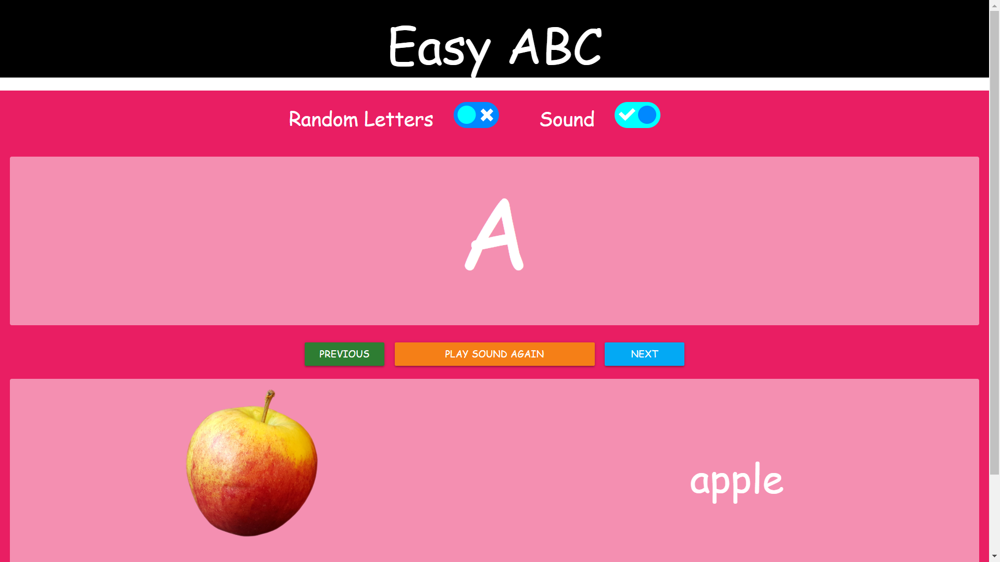

## ABC QUIZ GAME (React,with sounds) 
this is simple game made in react.js using sounds helpful for small children to learn A,B,C... in a fun and interactive manner.This app has super easy ui for small children.

### Technology Used
1:React.js : frontend js framework

2:Materialise.css : Css library for front end 

3:UIfx npm :for adding sounds.

### Notes
3 sounds are missing ('A','APPLE','B')...this is because of some files are missing from server...i will re add them as quickly as possible.
all other sounds are working fine.

### for screenshots 

  </img>
